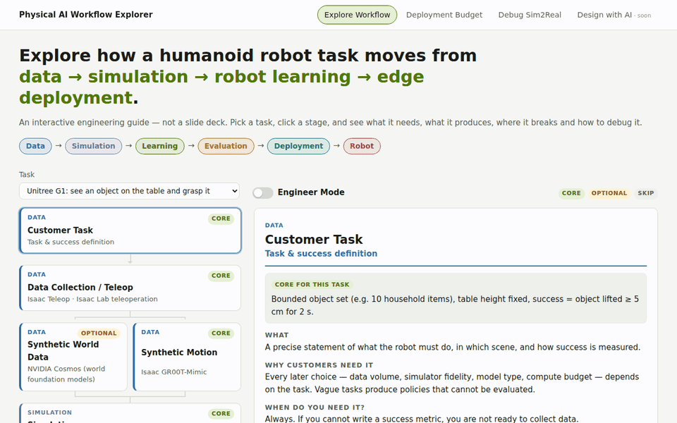

# Physical AI Workflow Explorer

**An interactive engineering guide to building, evaluating and deploying humanoid robot policies.**

```
Data → Simulation → Learning → Evaluation → Edge Deployment → Robot
```

🔗 **Live site:** https://imchong.github.io/Physical_AI_Workflow_Explorer/



## What it does

Pick a robot task — e.g. *“Let a Unitree G1 see an object on the table and grasp it”* — and the site expands the full NVIDIA Physical AI workflow for it:

```
Task → Teleop → Cosmos / GR00T-Mimic → Isaac Sim → Isaac Lab → GR00T (VLA)
     → Isaac Lab-Arena → ONNX / TensorRT → Jetson Thor → Isaac ROS / ROS 2 → Robot
```

| Section | What you can do |
|---|---|
| **Explore Workflow** | Click any stage for **What / Why / When do you need it / Input / Output / Bottleneck / Debug / NVIDIA tool / Sources**. Each task marks every stage as *core*, *optional* or *skip* with a reason (e.g. locomotion doesn't need a VLA). |
| **Engineer Mode** | Numbers and timing instead of concepts. On the GR00T stage: drag the **VLA inference frequency** slider and see inference period, low-level control cycles between VLA updates, action-chunk coverage, and a warning when the chunk runs out before the next inference. |
| **Deployment Budget** | Enter per-stage latency (camera, pre/post, inference, ROS). Get total latency, max frequency, over/under budget vs. a target rate, the largest bottleneck, a sequential vs. pipelined comparison, and a what-if inference speed-up along the PyTorch → ONNX → TensorRT → Jetson Thor path. |
| **Debug Sim2Real** | *“My humanoid policy works in simulation but fails on the robot. Why?”* Pick a symptom → candidate causes → SIM vs. REAL picture, how to check, how to fix, and example domain-randomisation ranges. |
| **中文 / English** | One-click language switch (also `?lang=zh` / `?lang=en` in the URL; defaults to the browser language). |
| **Light / Dark** | Follows the OS theme by default; the ☾ / ☀ button overrides it and the choice is remembered. |
| **Design with AI** | *Planned* — an AI architect that turns a robot/task/data description into a structured workflow recommendation. |

## Why I built this

Robotics developers often understand individual tools but struggle to understand how data, simulation, robot learning, evaluation and edge deployment fit together.

This project makes the Physical AI workflow explorable from both a developer and a customer-engineering perspective: not *“GR00T is a VLA”*, but *“when does your problem need GR00T, and what will break when you deploy it?”*

## What this demonstrates

- ✓ NVIDIA Physical AI architecture understanding
- ✓ Humanoid robot learning (RL / IL / VLA)
- ✓ Sim2Real debugging
- ✓ GR00T / VLA, action chunking and control hierarchy
- ✓ Isaac Sim / Isaac Lab / Isaac Lab-Arena
- ✓ ROS 2 deployment
- ✓ Jetson inference and latency-budget thinking
- ✓ Technical communication and developer-experience design

## Accuracy notes

- Product descriptions link to public NVIDIA sources on every stage (GR00T repo & end-to-end blog, Isaac Lab, Cosmos Cookbook, Jetson Thor spec page, Isaac ROS docs, …).
- Values labelled **“example”** (control rates, latencies, randomisation ranges) are illustrative and robot dependent — **not** official NVIDIA specifications. Replace them with your own measurements.
- *core / optional / skip* recommendations per task are the author's engineering judgement.
- Independent project; not affiliated with or endorsed by NVIDIA.

## Run locally

No build step — plain HTML/CSS/JS.

```bash
python3 -m http.server 8000
# open http://localhost:8000
```

Content lives in data files, so adding a stage, task or Sim2Real cause doesn't touch the UI code:

```
index.html
assets/js/workflow-data.js   # stages, tasks, sources (English)
assets/js/sim2real-data.js   # symptoms → causes (English)
assets/js/i18n.js            # UI strings, en + zh
assets/js/content-zh.js      # Chinese content overrides (falls back to English per field)
assets/js/app.js             # rendering, calculators, routing (#/workflow/<id>, #/budget, #/sim2real/<symptom>/<cause>)
assets/css/style.css
```

## Deploy

`.github/workflows/pages.yml` publishes the repository root to GitHub Pages on every push to `main`.
One-time setup: **Settings → Pages → Build and deployment → Source: GitHub Actions**.

## More of my work

- [Robotics Notebooks](https://imchong.github.io/Robotics_Notebooks/)
- [Robot Learning Paper Notebooks](https://imchong.github.io/Robot_Learning_Paper_Notebooks/)
- [Robot Description Gallery](https://imchong.github.io/Robot_Description_Gallery_Online/)
- [Robot Retarget Online](https://imchong.github.io/Robot_Retarget_Online/)
- [Sim2Sim Online](https://imchong.github.io/Robot_Learning_Sim2Sim_Online/)
- [Policy I/O Board](https://imchong.github.io/Robot_Learning_IO_Board_Online/)
- [Joint Order Check Tool](https://imchong.github.io/Robot_Joint_Order_Check_Tool_Online/)
- [GitHub](https://github.com/ImChong) · [Personal site](https://imchong.github.io/)

## License

[MIT](LICENSE)
